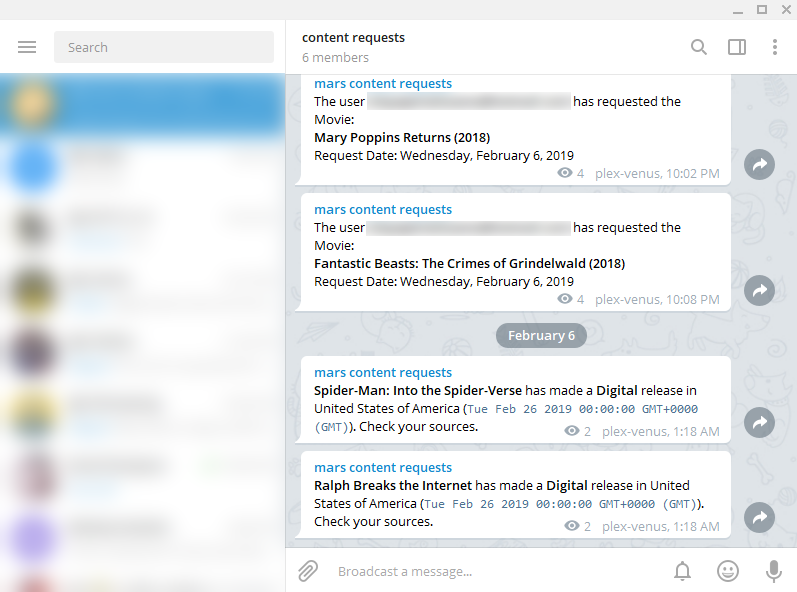

Is X movie out yet?
===================

Notifies you when an Ombi movie request is available for digital or physical purchase.

## Intended configuration
The intended use is to throw `outyet.js` into your crontab and check once a day ([`0 0 * * *`](https://crontab.guru/#0_0_*_*_*)) to see if the current day matches the day of release. In the event it does, outyet will notify you via Telegram that the movie has released.

## Screenshot

## Running an instance
- Clone repo: `git clone https://github.com/au5ton/out-yet.git`
- Install dependencies: `npm install`
- Supply environment variables: `cp env.example .env; nano .env`
    - [TheMovieDb API key](https://developers.themoviedb.org/3)
    - [Ombi API key](https://github.com/tidusjar/Ombi/wiki/Ombi-Settings#api-key)
    - Ombi server host (the part that comes before the /api endpoint)
    - [Telegram bot token](https://core.telegram.org/bots#3-how-do-i-create-a-bot)
    - [Telegram chat id](https://telegram.me/myidbot)
- Do a clean run, make sure there's no errors: `./outyet.js`
- If no errors, edit your crontab: `crontab -e`
- Add the following: `0 0 * * * ENV_FILE=/location/of/out-yet/.env /location/of/out-yet/outyet.js`
- Wait for the call 7

## I'm getting notifications about an already satisfied request
Remove it from Ombi. This is a personal tool, and that's what I do.